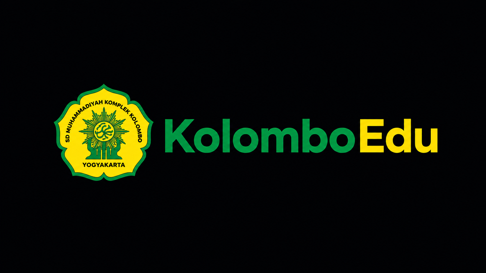

<div align="center">
  
  <br><br>
  <h1>KolomboEdu</h1>
  <p><strong>Sistem Informasi Terpadu SD Muhammadiyah Komplek Kolombo Yogyakarta</strong></p>
  <p>A modern, responsive, and dynamic web platform designed to streamline school management and digital presence.</p>
</div>

---

## 📖 Deskripsi Project

Aplikasi ini adalah sistem informasi sekolah terpadu berbasis web yang dirancang khusus untuk **SD Muhammadiyah Kolombo**. Website ini memiliki dua antarmuka utama:
1. **Public Portal**: Menampilkan informasi seputar sekolah, profil, tenaga pendidik, berita, hingga pencapaian dan kegiatan ekstrakurikuler kepada masyarakat umum.
2. **Admin Dashboard**: Sistem Manajemen Konten (CMS) komprehensif bagi pihak internal sekolah untuk mengelola informasi, postingan, foto, dan konfigurasi website secara dinamis.

Proyek ini dibangun dengan memprioritaskan antarmuka yang modern, kecepatan akses, serta kemudahan dalam pengelolaan (User-Friendly).

---

## 👨‍💻 Tim Pengembang

Proyek ini dikembangkan oleh:

| Peran (Role) | Nama Lengkap | NIM | Kontribusi |
| :--- | :--- | :--- | :--- |
| Project Manager | Dzaky Ridhwan Rosyada | 2300018398 | Project Planning & Coordination |
| UI/UX Designer | Fauziyah Tahta Dirgantari | 2300018252 | Wireframe & Design System |
| Frontend Developer | M Ilham Nurdin | 2300018406 | Frontend Development |
| Backend Developer | Aditya Bintang Rianda Syahputra | 2300018399 | Backend, Database & Docker |
| Quality Assurance (Tester) | Trizana Wafi Reswara | 2300018258 | Testing & Quality Assurance |

---

## ✨ Features

- **Dynamic Public Portal**: 
  - Beranda (Hero section, statistik, sambutan)
  - Profil Singkat & Visi Misi
  - Daftar Guru & Tenaga Kependidikan
  - Direktori Berita & Artikel
  - Galeri Prestasi & Ekstrakurikuler
  - Formulir Kontak / Pesan
- **Admin Dashboard (AdminLTE 3)**:
  - Manajemen Pengguna (Role: Admin)
  - Pengelolaan Berita (CRUD)
  - Pengelolaan Guru & Staff (CRUD)
  - Pengelolaan Prestasi (CRUD)
  - Pengelolaan Ekstrakurikuler (CRUD)
  - Inbox Pesan dari Pengunjung
  - Pengaturan Website (Logo, Kontak, Teks Hero)
- **Modern UI/UX**: Tema profesional (Navy Blue), responsif di semua perangkat (Mobile, Tablet, Desktop).
- **Environment**: Terkonfigurasi untuk lokal dan *containerized development* dengan Docker.

---

## 🛠 Tech Stack

- **Backend / Framework**: [Laravel 11.x](https://laravel.com)
- **Frontend (Public)**: Vanilla CSS / TailwindCSS, Blade Templating
- **Frontend (Admin)**: [AdminLTE 3](https://adminlte.io), Bootstrap 4, jQuery
- **Database**: MySQL 8.x
- **Development Environment**: Docker & Laravel Sail (atau Laragon/XAMPP)

---

## 🚀 Installation

Website ini dapat dijalankan menggunakan **Docker** (direkomendasikan) atau **Non-Docker** (Laragon/XAMPP). 

### Opsi 1: Menggunakan Docker (Rekomendasi)
*Syarat: Docker Desktop harus terinstal dan berjalan.*

1. **Clone repository**
   ```bash
   git clone https://github.com/Nexabyte-UAD/sd-muhammadiyah-kolombo.git
   cd sd-muhammadiyah-kolombo
   ```
2. **Persiapkan Environment**
   ```bash
   cp .env.example .env
   ```
3. **Install Dependensi Awal (Composer)**
   Karena konfigurasi Docker dari Laravel Sail berada di dalam folder `vendor` yang disembunyikan dari GitHub, Anda harus menginstal dependensinya dulu via container composer sementara:
   ```bash
   docker run --rm -v "%cd%:/var/www/html" -w /var/www/html laravelsail/php82-composer:latest composer install --ignore-platform-reqs
   ```
   *(Catatan: Jika memakai Mac/Linux/WSL, ganti `"%cd%"` menjadi `"$(pwd)"`)*

4. **Nyalakan Container & Build**
   ```bash
   docker-compose up -d --build
   ```
5. **Konfigurasi & Migrasi Database**
   ```bash
   docker-compose exec laravel.test php artisan key:generate
   docker-compose exec laravel.test php artisan migrate:fresh --seed
   ```
6. **Akses Website**
   Buka `http://localhost` di browser Anda.

### Opsi 2: Non-Docker (Laragon / XAMPP)
*Syarat: PHP 8.2+, Composer, dan MySQL/MariaDB.*

1. **Clone dan persiapkan repo** (sama seperti langkah 1 & 2 di atas).
2. **Install Dependensi**
   ```bash
   composer install
   ```
3. **Konfigurasi Database**
   - **Penting:** Buat database kosong terlebih dahulu di phpMyAdmin / HeidiSQL Anda (misalnya dengan nama `muhammadiahkolombo`).
   - Buka file `.env`, lalu sesuaikan koneksinya:
   ```env
   DB_CONNECTION=mysql
   DB_HOST=127.0.0.1
   DB_PORT=3306
   DB_DATABASE=muhammadiahkolombo
   DB_USERNAME=root
   DB_PASSWORD=
   ```
4. **Generate Key & Migrasi**
   ```bash
   copy .env.example .env
   php artisan key:generate
   php artisan migrate:fresh --seed
   ```
5. **Jalankan Server Lokal**
   ```bash
   php artisan serve
   ```
   Akses di `http://127.0.0.1:8000`.

---

## 🌐 Deployment

Untuk melakukan deployment ke server production (VPS / Shared Hosting):
1. Pastikan server memiliki dukungan minimal PHP 8.2 dan ekstensi yang dibutuhkan.
2. Atur konfigurasi `.env`, khususnya:
   - `APP_ENV=production`
   - `APP_DEBUG=false`
   - `APP_URL=https://domainsekolah.com`
3. Optimalkan framework:
   ```bash
   composer install --optimize-autoloader --no-dev
   php artisan config:cache
   php artisan route:cache
   php artisan view:cache
   ```
4. Arahkan *Document Root* dari web server (Nginx/Apache) ke folder `public/`.

---

## 🏛 System Architecture

Arsitektur sistem mengikuti pola standar MVC (Model-View-Controller) bawaan Laravel:
- **Models**: Merepresentasikan tabel database dan relasi antar data (Eloquent ORM).
- **Views**: Blade template untuk merender antarmuka pengguna, dipisahkan antara `layouts/public` dan `layouts/admin`.
- **Controllers**: Mengendalikan *business logic* dan penghubung antara Model dan View.
- **Routing**: Dikelola secara terpisah untuk rute *public* (`web.php`) dan rute otentikasi/admin (`auth.php`).

---

## 🗄 Database / Modules

Aplikasi ini menggunakan modul-modul berikut untuk mengelola data:

1. **Users**: Manajemen akun administrator.
2. **ProfilSekolah**: Pengaturan data Visi & Misi dan profil panjang.
3. **GuruStaff**: Manajemen data tenaga pendidik dan staff administrasi.
4. **Berita**: Modul pengelolaan artikel, pengumuman, dan berita sekolah.
5. **Prestasi**: Katalog pencapaian siswa dan sekolah.
6. **Ekstrakurikuler**: Katalog kegiatan luar jam pelajaran.
7. **Pesan**: Menyimpan pesan/masukan dari pengunjung via formulir kontak.
8. **Setting**: Konfigurasi dinamis web (seperti Hero Image, Sambutan Kepala Sekolah, Kontak).
9. **ActivityLog**: Catatan log sistem/aktivitas.

---

## 📂 Folder Structure

Berikut adalah struktur folder utama dari aplikasi ini:

```text
/
├── app/
│   ├── Http/Controllers/     # Logika aplikasi (Admin & Public)
│   ├── Models/               # Representasi data (Berita, Guru, dll)
├── database/
│   ├── migrations/           # Skema tabel database
│   ├── seeders/              # Data awal untuk database (Admin)
├── public/                   # Aset publik (CSS, JS, Images, Uploads)
├── resources/
│   ├── views/
│   │   ├── admin/            # Tampilan dashboard AdminLTE
│   │   ├── layouts/          # Template induk (Public & Admin)
│   │   ├── pages/            # Tampilan public (Beranda, Berita, dll)
│   │   └── auth/             # Tampilan login
├── routes/
│   ├── web.php               # Routing untuk public portal
│   └── auth.php              # Routing untuk area otentikasi
├── compose.yaml              # Konfigurasi Docker (Laravel Sail)
└── .env                      # Variabel lingkungan dan koneksi DB
```

### Penjelasan Detail

| Folder / File | Fungsi & Penjelasan Detail |
| :--- | :--- |
| `app/Http/Controllers/` | **Otak Aplikasi**: Berisi logika yang menghubungkan tampilan (View) dengan database (Model). Contoh: `HomeController` untuk public, `BeritaController` untuk admin. |
| `app/Models/` | **Representasi Database**: Mengatur interaksi langsung dengan tabel database seperti `Berita`, `GuruStaff`, dll menggunakan Eloquent ORM. |
| `database/migrations/` | **Skema Database**: *Blueprint* otomatis untuk membuat struktur tabel (kolom, tipe data) di MySQL. |
| `database/seeders/` | **Data Awal**: Berisi skrip untuk memasukkan data *dummy* atau data bawaan (seperti akun Admin `admin@sekolah.com`). |
| `public/` | **Aset Publik**: Folder yang dapat diakses langsung oleh internet. Berisi CSS, JS, font, serta file gambar yang di-upload. |
| `resources/views/admin/` | **Tampilan Admin**: Kode HTML/Blade khusus untuk Dashboard AdminLTE (manajemen data). |
| `resources/views/layouts/` | **Template Induk**: Kerangka utama website (seperti header & footer yang diulang-ulang). Terdapat layout `public` dan `admin`. |
| `resources/views/pages/` | **Tampilan Publik**: Kode HTML/Blade untuk halaman depan yang dilihat masyarakat umum (Beranda, Berita, dll). |
| `routes/web.php` | **Navigasi Utama**: Mengatur URL website. Mengarahkan pengunjung ke *Controller* yang tepat. |
| `routes/auth.php` | **Navigasi Login**: Rute khusus untuk sistem otentikasi (login, logout, lupa password). |
| `.env` | **Konfigurasi Rahasia**: File untuk menyimpan *password* database, koneksi server, dan kunci API. (Aman dan tidak diunggah ke GitHub). |
| `compose.yaml` | **Resep Docker**: Konfigurasi otomatis untuk menyalakan server PHP, MySQL, Redis, dan Cloudflare Tunnel secara bersamaan. |
| `composer.json` | **Daftar Dependensi**: Mencatat pustaka pihak ketiga (seperti framework Laravel, AdminLTE, dll) yang dibutuhkan aplikasi. |
| `test/user` | **Testing**:  Berisi file automation testing untuk fitur user/public website seperti navigation, dropdown, dan contact form. |

---
# 🏫 SD Muhammadiyah Kolombo - Automation Testing

Project automation testing untuk website sekolah menggunakan:

* Python
* Playwright
* Pytest

Testing difokuskan pada fitur user/public website seperti:

* Navigation menu
* Dropdown menu
* Contact form

---

# 🐍 Setup Python Virtual Environment

## 2. Membuat Virtual Environment

HEAD
```bash
python -m venv venv
```

### Opsi 1: Menggunakan Docker (Rekomendasi)
*Syarat: Docker Desktop harus terinstal dan berjalan.*

1. **Clone repository**
   ```bash
   git clone <repo-url>
   cd MuhammadiahKolombo
   ```
2. **Persiapkan Environment**
   ```bash
   cp .env.example .env
   ```
3. **Nyalakan Container & Build**
   ```bash
   docker-compose up -d --build
   ```
4. **Install Dependensi & Konfigurasi**
   ```bash
   docker-compose exec laravel.test composer install
   docker-compose exec laravel.test php artisan key:generate
   ```
5. **Migrasi Database & Seeding**
   ```bash
   docker-compose exec laravel.test php artisan migrate:fresh --seed
   ```
6. **Akses Website**
   Buka `http://localhost` di browser Anda.

### Opsi 2: Non-Docker (Laragon / XAMPP)
*Syarat: PHP 8.2+, Composer, dan MySQL/MariaDB.*

1. **Clone dan persiapkan repo** (sama seperti langkah 1 & 2 di atas).
2. **Install Dependensi**
   ```bash
   composer install
   ```
3. **Konfigurasi Database**
   Buka file `.env`, sesuaikan nama database, username, dan password:
   ```env
   DB_CONNECTION=mysql
   DB_HOST=127.0.0.1
   DB_PORT=3306
   DB_DATABASE=muhammadiahkolombo
   DB_USERNAME=root
   DB_PASSWORD=
   ```
4. **Environment & Generate Key & Migrasi **
   ```bash
   cp .env.example .env
   php artisan key:generate
   php artisan migrate:fresh --seed
   ```
5. **Jalankan Server Lokal**
   ```bash
   php artisan serve
   ```
   Akses di `http://127.0.0.1:8000`.
41f3f76 (Menambahkan automation testing Playwright untuk user)

---

## 3. Aktivasi Virtual Environment

### Windows PowerShell

```powershell
.\venv\Scripts\Activate.ps1
```

### Windows CMD

```cmd
venv\Scripts\activate
```

---

# 📚 Install Dependency

## 4. Install Playwright dan Pytest

```bash
pip install playwright pytest
```

---

## 5. Install Browser Playwright

```bash
playwright install
```

---

# 🚀 Menjalankan Laravel

Pastikan server Laravel berjalan.

```bash
php artisan serve
```

Default:

```txt
http://127.0.0.1:8000
```

---

# 📁 Struktur Folder Testing

```txt
test/
│
├── user/
│   ├── test_navigation.py
│   ├── test_profile.py
│   ├── test_structural.py
│   └── test_contact.py
```

---

# 🧪 Automation Testing

## 1. Navigation Testing

File:

```txt
test/user/test_navigation.py
```

Fitur yang dites:

* Homepage
* Prestasi
* Berita
* Ekstrakurikuler
* Kontak

Menjalankan test:

```bash
pytest test/user/test_navigation.py
```

---

## 2. Profile Dropdown Testing

File:

```txt
test/user/test_profile.py
```

Fitur yang dites:

* Kata Sambutan
* Tentang
* Visi & Misi
* Akreditasi

Menjalankan test:

```bash
pytest test/user/test_profile.py
```

---

## 3. Structural Dropdown Testing

File:

```txt
test/user/test_structural.py
```

Fitur yang dites:

* Guru
* Staf

Menjalankan test:

```bash
pytest test/user/test_structural.py
```

---

## 4. Contact Form Testing

File:

```txt
test/user/test_contact.py
```

Fitur yang dites:

* Input nama
* Input email
* Input pesan
* Submit form

Menjalankan test:

```bash
pytest test/user/test_contact.py
```

---

# ▶️ Menjalankan Semua Testing

```bash
pytest test/user
```

---

# ✅ Hasil Testing

Jika berhasil:

```txt
4 passed
```

atau sesuai jumlah test yang dijalankan.

---

# 👨‍💻 Developer

Automation testing dibuat untuk kebutuhan project website sekolah SD Muhammadiyah Kolombo.

## 📄 License

Proyek ini dilisensikan di bawah **MIT License**. Lihat file [LICENSE](LICENSE) untuk informasi lebih lanjut.
